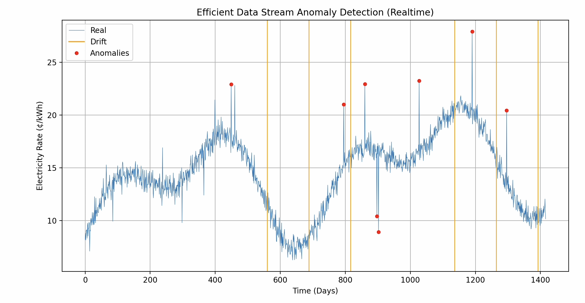

# Efficient Data Stream Anomaly Detection

## Overview
This project implements a Python script designed to detect anomalies in a continuous data stream. The simulated data stream represents real-time sequences of floating-point numbers, which could reflect various metrics, such as financial transactions, sensor readings, or system performance metrics. The primary objective is to identify unusual patterns, such as exceptionally high values or significant deviations from expected behavior.

## Solution
### Anomaly Detection Algorithm
The system employs a combination of two powerful algorithms:
- **ADWIN (Adaptive Windowing)**: An adaptive algorithm that detects changes in the data distribution over time, allowing for dynamic adjustment to the model as new data arrives.
- **S-H-ESD (Seasonal Hybrid Extreme Studentized Deviate)**: A robust statistical method that identifies anomalies in seasonal data, accounting for regular patterns and extreme values.
  
### Visualization
The project includes a straightforward real-time visualization tool that displays:
- The live data stream
- Detected anomalies marked on the plot
This enables users to monitor the data and quickly identify any unusual patterns.

## Prerequisites
To run this project, you will need:
- **Python 3.x**: Ensure you have the latest version installed on your machine. You can download it from [python.org](https://www.python.org/downloads/).

## Usage
Run first

<code> pip install -r requirements.txt </code> 

and then

<code> python datastream_anomaly_detection.py </code>

Enjoy :)
